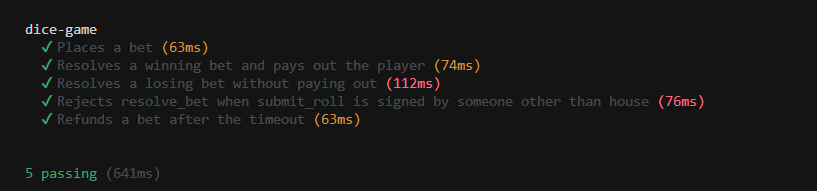

# Anchor Dice Game — Instruction Introspection

A Solana program (Anchor) implementing a simple dice betting game. The player
picks a target roll and a bet amount; the house resolves the bet by submitting
the rolled number in a separate instruction within the same transaction.
`resolve_bet` uses **instruction introspection** to read and verify that
submission before paying out — without relying on Ed25519 signature
verification.

## Assignment

This program was built for the "Instruction Introspection" assignment
(Challenge 1): *write a contract that uses instruction introspection, but with
a different structure in `resolve_bet` instead of an Ed25519 signature.*

Instead of the house signing the bet data off-chain with Ed25519 and the
program verifying that signature via the Ed25519 native program, this program
defines its own `submit_roll` instruction. The house includes
`submit_roll(roll)` as the first instruction of the transaction, followed by
`resolve_bet`. `resolve_bet` reads the `submit_roll` instruction directly from
the [instructions sysvar](https://docs.solanalabs.com/runtime/sysvars#instructions),
checks that it:

- targets this program (not some other program),
- carries the `submit_roll` discriminator with exactly one `u8` argument,
- was signed by the `house`,
- references the same `bet` account being resolved,
- carries a `roll` value in the valid range `1..=100`,

and then uses that `roll` to determine whether the player won or lost.

## Program flow

### 1. `initialize`
The house funds a vault PDA (`["vault", house]`) that backs all payouts.

### 2. `place_bet`
The player deposits `amount` lamports into the vault and creates a `Bet`
account (PDA: `["bet", vault, player, seed]`) recording:

| Field    | Description                                |
|----------|---------------------------------------------|
| `player` | the bettor                                  |
| `seed`   | client-supplied u128, makes the PDA unique  |
| `slot`   | the slot the bet was placed at              |
| `amount` | bet amount in lamports                      |
| `roll`   | the target roll (player wins if result < roll) |
| `bump`   | PDA bump                                    |

Constraints: `amount >= MIN_BET_LAMPORTS` (0.01 SOL), `MIN_ROLL <= roll <= MAX_ROLL` (1–99).

### 3. `submit_roll` + `resolve_bet` (single transaction)
The house builds a transaction with two instructions:

```
[0] submit_roll(roll: u8)   accounts: [house (signer), bet]
[1] resolve_bet()           accounts: [house, player, vault, bet, instruction_sysvar, system_program]
```

- `submit_roll` is a no-op on-chain — its only purpose is to place a
  verifiable, custom-shaped instruction into the transaction.
- `resolve_bet` introspects instruction `[0]` via
  `load_instruction_at_checked`, validates it as described above, and extracts
  the `roll` byte from its instruction data.
- If `bet.roll > roll` (the player's target is higher than the resolved roll),
  the player wins and receives a payout from the vault:

  ```
  payout = bet.amount * (10_000 - HOUSE_EDGE_BASIS_POINTS) / (bet.roll - 1) / 100
  ```

  (1.5% house edge, lower target rolls pay out more since they're harder to win).
- Either way, the `bet` account is closed and its rent is refunded to the player.

### 4. `refund_bet`
If the house never resolves the bet, the player can reclaim their `amount`
(plus the account's rent) once `1000` slots have elapsed since `bet.slot`.

## Accounts & PDAs

| PDA      | Seeds                                              |
|----------|-----------------------------------------------------|
| `vault`  | `["vault", house]`                                  |
| `bet`    | `["bet", vault, player, seed (le bytes)]`           |

## Errors

| Error                          | Meaning                                                      |
|---------------------------------|--------------------------------------------------------------|
| `MinimumBet` / `MaximumBet`      | Bet amount out of range                                       |
| `MinimumRoll` / `MaximumRoll`    | Target roll out of range                                      |
| `TimeoutNotReached`              | `refund_bet` called before 1000 slots have elapsed            |
| `InvalidIntrospectedProgram`     | Instruction `[0]` does not target this program                |
| `InvalidIntrospectedInstruction` | Instruction `[0]` is not a valid `submit_roll` call           |
| `InvalidRollSigner`              | `submit_roll`'s `house` account doesn't match / didn't sign   |
| `BetMismatch`                    | `submit_roll`'s `bet` account doesn't match the bet being resolved |
| `InvalidRollValue`               | Submitted roll is not in `1..=100`                            |

## Running the tests

```bash
anchor build
anchor test
```

The test suite ([tests/anchor-1-dice-game.ts](tests/anchor-1-dice-game.ts)) covers:

- placing a bet,
- resolving a winning bet (payout + rent refund math, account closure),
- resolving a losing bet (no payout, rent still refunded),
- rejecting `resolve_bet` when the introspected `submit_roll` is not signed by the house,
- rejecting `refund_bet` before the timeout.

### All tests passing


